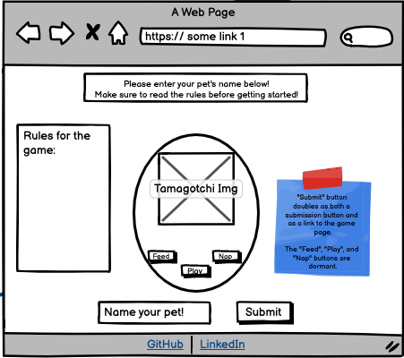

# christielewis-tamagotchi

### Overview

Let's start out with something fun—**a game!**

Everyone will get a chance to **be creative**, and work through some really **tough programming challenges**.

**You will be working individually for this project**, but we'll be guiding you along the process and helping as you go. Show us what you've got!

---

### Specifications
  
* Display a character of your choice on the screen to represent your pet
* Name your pet
* Hunger - increases every 2.5 seconds
* Sleepiness- increases by 1, every 4 seconds
* Boredom - increases by 1 every 3 seconds
* Age - increases every 1.25 seconds
* Buttons: 
 * Enter - connects/links to game page/second page
 * Start - starts intervals
 * Feed - decreases Hunger by 1, **but increases Boredom by 1**
 * Nap - decreases sleepiness by 1, **but increases Hunger by 1**
 * Play - decreases Boredom by 1, **but increases Sleepiness by 1**
 * Yes - acts as a reset button
 * No - connects/links to intro page/first page
* Pet dies if Hunger, Boredom, or Sleepiness hits 10.